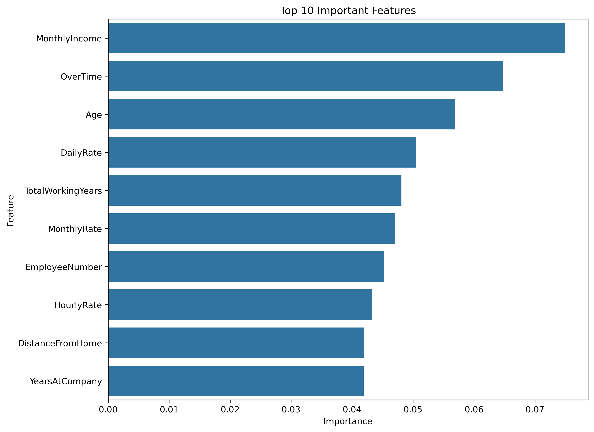
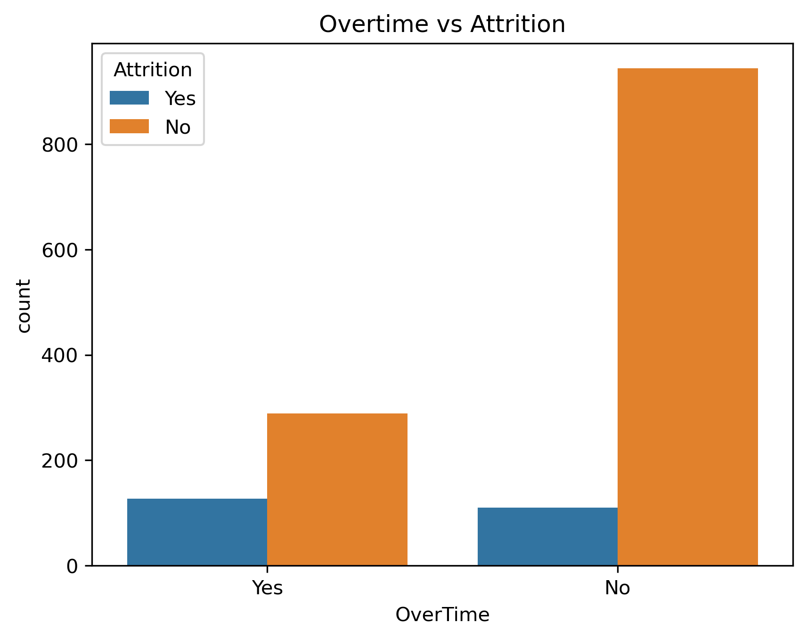
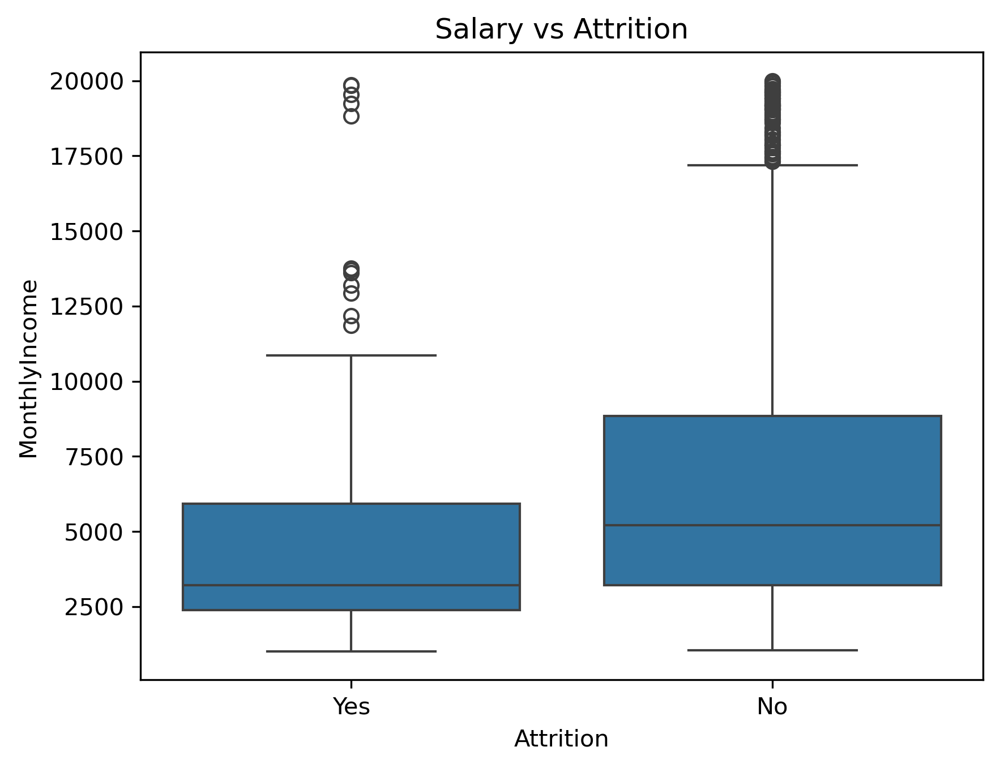

# HR Employee Attrition Analysis


End-to-end data analysis and machine learning project to identify the key drivers of employee attrition. This project builds a full analytical pipeline from exploratory data analysis (EDA) to a predictive Random Forest Classifier model, answering critical HR business questions and providing actionable retention strategies.

---

## Portfolio Summary

- Executed an end-to-end pipeline covering data ingestion, cleaning, exploratory data analysis, and predictive modeling using Python, Pandas, and Scikit-Learn.
- Answered core business questions on how salary, overtime, and job roles impact an employee's decision to leave.
- Surfaced actionable insights through statistical analysis and compelling visualizations (Seaborn/Matplotlib).
- Trained a **Random Forest Classifier** to predict employee turnover and identified the most critical features driving attrition.
- Delivered a reproducible notebook containing a comprehensive data story and business recommendations.

---

## Business Questions

1. What is the overall attrition rate in the company?
2. Does working overtime significantly increase the risk of attrition?
3. How does monthly income vary between employees who leave versus those who stay?
4. Which departments and job roles experience the highest turnover?
5. Can we reliably predict whether an employee will leave based on their HR profile?

---

## Key Findings

| Insight | Result |
| --- | --- |
| **Overall Attrition** | Approximately 16% of the workforce left the company. |
| **Overtime Impact** | Employees working overtime have a disproportionately higher attrition rate compared to those who do not. |
| **Salary Factor** | Employees who left had noticeably lower median monthly incomes compared to those who stayed. |
| **Job Role Vulnerability** | Roles like Sales Representatives and Laboratory Technicians showed higher susceptibility to turnover. |
| **Top Attrition Drivers** | The Random Forest model identified **Monthly Income**, **Age**, **OverTime**, and **Total Working Years** as the top predictors of attrition. |

---

## Visual Insights

### 1. Feature Importance (What drives employees to leave?)

*The Random Forest model highlights that compensation (Monthly Income), Age, and OverTime are the strongest predictors of whether an employee will stay or go.*

### 2. Overtime vs Attrition

*A clear visual correlation: Employees working overtime are at a significantly higher risk of burnout and attrition.*

### 3. Salary Distribution

*Employees leaving the company tend to cluster at the lower end of the monthly income spectrum.*

---

## Dataset

| Property | Value |
| --- | --- |
| Source | HR Employee Attrition Dataset (IBM Watson Analytics) |
| Instances | 1,470 Employees |
| Features | 35 variables (Age, Department, DistanceFromHome, MonthlyIncome, OverTime, etc.) |
| Target Variable | `Attrition` (Yes / No) |

---

## Project Structure

```
employee-attrition-analysis/
├── Charts/
│   ├── 01_attrition_distribution.png
│   ├── 02_overtime_attrition.png
│   ├── 03_salary_vs_attrition.png
│   ├── 04_heatmap.png
│   ├── 05_confusion_matrix.png
│   └── 06_feature_importance.png
├── WA_Fn-UseC_-HR-Employee-Attrition.csv  # Raw Dataset
├── employee-attrition-analysis.ipynb      # Main Analysis Notebook
├── requirements.txt                       # Project Dependencies
└── README.md                              # Project Documentation
```

## How to Run

1. Clone this repository:
   ```bash
   git clone https://github.com/ritscode17/employee-attrition-analysis.git
   ```
2. Navigate to the project directory:
   ```bash
   cd employee-attrition-analysis
   ```
3. Install the required dependencies:
   ```bash
   pip install -r requirements.txt
   ```
4. Launch Jupyter Notebook and open `employee-attrition-analysis.ipynb`:
   ```bash
   jupyter notebook
   ```
